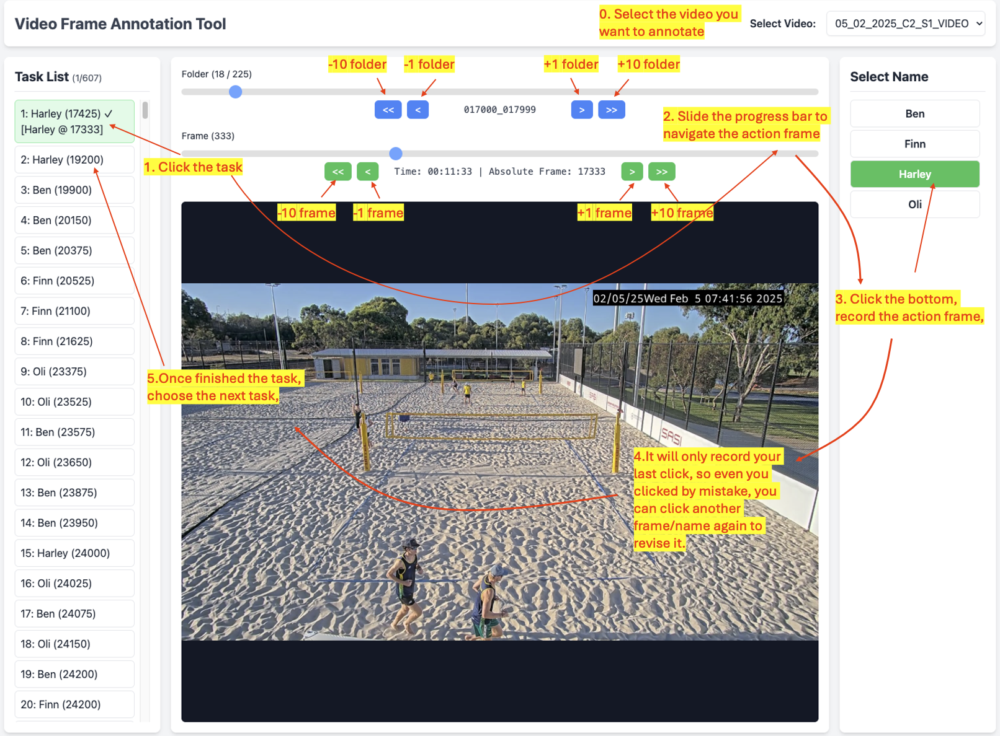
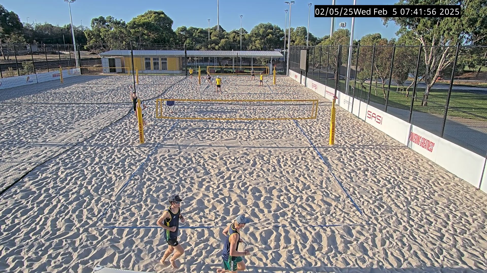
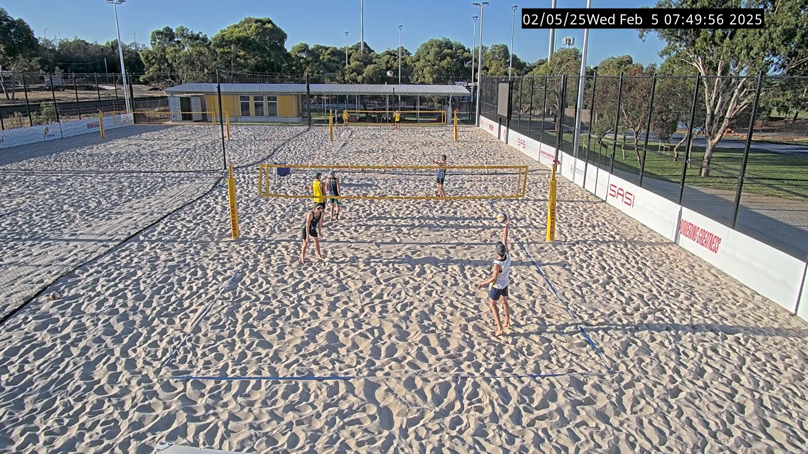
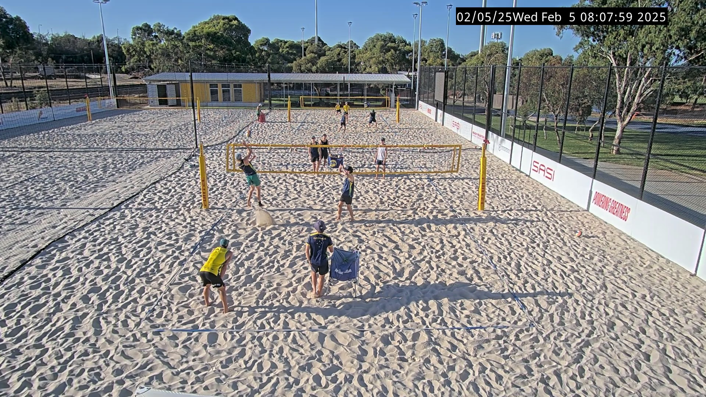

# Video Frame Annotation Tool

A web-based video frame annotation tool designed for precise volleyball action labeling. This tool allows you to navigate video frames efficiently and annotate specific actions with player names.

## Overview

This annotation tool is specifically designed for volleyball video analysis. It provides:
- Frame-by-frame navigation through video datasets
- Task-based annotation workflow
- Keyboard shortcuts for efficient navigation
- Real-time image preloading for smooth performance
- Independent annotation storage per dataset

## User Interface



The interface consists of:
- **Video Selection**: Choose from available video datasets
- **Task List**: Shows annotation tasks with progress indicators (green = completed, blue = currently selected)
- **Name List**: Available player names for annotation (green = currently annotated for this task/frame)
- **Frame Navigation**: Sliders and buttons for precise frame control
- **Image Display**: Current frame with time and absolute frame information

## Requirements

### Environment
- Python 3.7+
- Flask
- pandas
- numpy
- OpenCV (for frame extraction)

### Installation
```bash
pip install flask pandas numpy opencv-python
```

## Setup Instructions

### 1. File Placement
1. Download "Kent volleyball annotated video and Catapul data 21 03 2025"
2. Extract to your working directory
3. Ensure the video paths in `extract_frames.py` match your extracted files (`<dataset>` for example is  `05_02_2025_C2_S1`):
   ```
   ./Kent volleyball annotated video and Catapul data 21 03 2025/data/<dataset>/RAW VIDEO/<dataset>_VIDEO.mp4
   ```

### 2. Frame Extraction (Step 1)
Extract all video frames at 25fps:
```bash
python extract_frames.py
```

This will:
- Process all videos listed in the script
- Extract frames at 25fps (regardless of original video framerate)
- Save frames in organized folders: `static/frames/{video_name}/{start_frame}_{end_frame}/`
- Each folder contains 1000 frames (000000.jpg to 000999.jpg)

**Example directory structure after extraction:**
```
static/
└── frames/
    ├── 05_02_2025_C2_S1_VIDEO/
    │   ├── 000000_000999/
    │   │   ├── 000000.jpg
    │   │   ├── 000001.jpg
    │   │   ├── ...
    │   │   └── 000999.jpg
    │   ├── 001000_001999/
    │   │   ├── 000000.jpg
    │   │   ├── 000001.jpg
    │   │   ├── ...
    │   │   └── 000999.jpg
    │   └── 002000_002999/
    │       └── ...
    ├── 14_01_2025_C2_S1_VIDEO/
    │   ├── 000000_000999/
    │   ├── 001000_001999/
    │   └── ...
    └── 16_01_2025_C2_S1_VIDEO/
        ├── 000000_000999/
        ├── 001000_001999/
        └── ...
```


### 3. Start Annotation Tool (Step 2)
```bash
python app.py
```

This will start the Flask server. **Important:** The server address may vary on different machines. Always check the terminal output and use the address shown there.

**Note:** You'll see output similar to:
```
(SAM2) george@server7:~/Volleyball_Annotation$  python app.py 
 * Serving Flask app 'app'
 * Debug mode: on
WARNING: This is a development server. Do not use it in a production deployment. Use a production WSGI server instead.
 * Running on http://127.0.0.1:5001
Press CTRL+C to quit
 * Restarting with watchdog (inotify)
 * Debugger is active!
 * Debugger PIN: 241-609-728
```

Copy the URL from the "Running on" line and open it in your web browser to access the annotation tool. The address could be different (e.g., `http://localhost:5000`, `http://127.0.0.1:5000`, etc.) depending on your system configuration.

## How to Use the Annotation Tool

### Basic Workflow
1. **Select Video**: Choose a video dataset from the dropdown
2. **Select Task**: Click on a task from the task list (tasks are loaded from corresponding CSV files)
3. **Navigate to Frame**: The tool will automatically jump to the task's approximate frame
4. **Find Precise Frame**: Use navigation controls to find the exact moment of action
5. **Annotate**: Click on the correct player name to save the annotation

### Navigation Controls

#### Keyboard Shortcuts (Recommended)
- **← Arrow Key**: Move backward one frame (hold for continuous movement)
- **→ Arrow Key**: Move forward one frame (hold for continuous movement)
- **Smart Preloading**: Images are automatically preloaded for smooth navigation

#### Mouse Controls
- **Folder Navigation Buttons**: 
  - `<<10` / `>>10`: Jump 10 folders
  - `<1` / `>1`: Jump 1 folder
- **Frame Navigation Buttons**:
  - `<<10` / `>>10`: Jump 10 frames
  - `<1` / `>1`: Jump 1 frame
- **Sliders**: Direct position control for folders and frames

### Annotation Guidelines

#### Finding Precise Frames
- **Task frames are approximate**: The provided frame numbers are rough estimates
- **Your job**: Find the exact moment of ball contact/action around the suggested frame
- **Quality over quantity**: If a label seems incorrect or the action is unclear, skip it rather than mislabel

#### Correct Annotation Examples
Below are examples of properly annotated frames showing the exact moment of ball contact:


*Example 1: Perfect timing for volleyball action*


*Example 2: Perfect timing for volleyball action*


*Example 3: Perfect timing for volleyball action*

**Key Points for Accurate Annotation:**
- Look for the exact frame where the player's hand/body makes contact with the ball
- Avoid frames before or after the actual contact moment, if no perfect contact choose the nearest one

#### Annotation Process
1. Navigate to the task's suggested frame
2. Use arrow keys to find the precise moment of action
3. Look for the exact frame where the player makes contact with the ball
4. Click the correct player's name to save the annotation
5. The system will automatically mark the task as complete (green)

### Visual Indicators
- **Green Task**: Already annotated
- **Blue Task**: Currently selected
- **Green Name Button**: This name is annotated for the current task at this exact frame
- **Progress Counter**: Shows completed/total tasks for current video

## File Structure

```
project_root/
├── app.py                 # Main Flask application
├── extract_frames.py      # Video frame extraction script
├── static/
│   ├── frames/           # Extracted video frames
│   │   └── {video_name}/
│   │       └── {start}_{end}/
│   │           └── 000000.jpg to 000999.jpg
│   └── js/
│       └── main.js       # Frontend JavaScript
├── templates/
│   └── index.html        # Main interface template
├── label/                # Original CSV label files
├── annotations/          # Generated annotation files
│   └── {video_name}_annotations.json
└── README.md
```

## Output

All annotations are saved in `annotations/{dataset}_annotations.json` with the following format:

```json
{
  "taskIndex": {
    "video": "video_name",
    "folder": "folder_name", 
    "imageFile": "frame.jpg",
    "absoluteFrame": 12345,
    "name": "player_name",
    "taskIndex": 0
  }
}
```
## Contact

For questions or support, please contact: **chang.dong@adelaide.edu.au**
